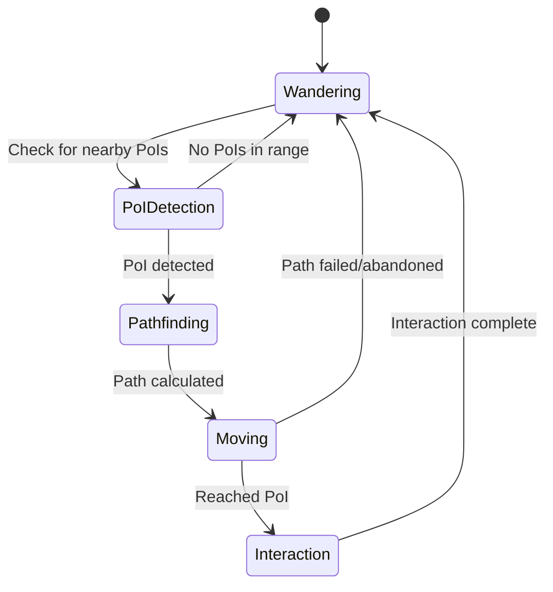

# Adventurer Pathfinding System Design

## Overview

The pathfinding system will be implemented as a lightweight enhancement to the existing Adventurer class. It will operate in two modes: **Wandering Mode** (default) and **Pathfinding Mode** (when a PoI is detected). The system uses simple algorithms to maintain the organic feel while adding intelligent navigation when needed.

## Architecture

### Core Components

1. **PathfindingManager** - Handles pathfinding logic and state management
2. **PoIDetector** - Scans for nearby PoIs within detection range
3. **SimplePathfinder** - Calculates basic paths around obstacles
4. **MovementController** - Coordinates between wandering and pathfinding modes

### System Flow



## Components and Interfaces

### PathfindingManager

```csharp
public class PathfindingManager
{
    public enum PathfindingState { Wandering, Pathfinding, Moving }
    public enum TargetPriority { Wandering, Discovered, Quest } // Quest = highest priority
    
    public PathfindingState CurrentState { get; private set; }
    public PointOfInterest CurrentTarget { get; private set; }
    public TargetPriority CurrentPriority { get; private set; }
    public Queue<Vector2> CurrentPath { get; private set; }
    
    public void Update(Vector2 currentPosition, ZoneManager zoneManager, PoIManager poiManager);
    public Vector2 GetNextDirection(Vector2 currentPosition, Vector2 currentDirection);
    public void SetQuestTarget(PointOfInterest target); // New: For quest system
    public void SetDiscoveredTarget(PointOfInterest target); // Current PoI detection
    public void AbandonCurrentTarget();
    public bool HasActiveTarget { get; }
}
```

### PoIDetector

```csharp
public class PoIDetector
{
    private const float DETECTION_RANGE = 160f; // 5 tiles
    private Dictionary<Guid, float> _poiCooldowns;
    
    public PointOfInterest FindNearestInterestingPoI(Vector2 position, PoIManager poiManager);
    public bool IsPoIOnCooldown(PointOfInterest poi);
    public void AddPoIToCooldown(PointOfInterest poi, float cooldownTime);
}
```

### SimplePathfinder

```csharp
public class SimplePathfinder
{
    public Queue<Vector2> FindPath(Vector2 start, Vector2 target, ZoneManager zoneManager, PoIManager poiManager);
    public bool IsPositionWalkable(Vector2 position, ZoneManager zoneManager, PoIManager poiManager);
    public Vector2 FindWalkablePositionNear(Vector2 target, ZoneManager zoneManager, PoIManager poiManager);
}
```

## Data Models

### PathfindingState Enhancement

The existing Adventurer class will be enhanced with pathfinding state:

```csharp
public class Adventurer
{
    // Existing fields...
    
    // New pathfinding fields
    private PathfindingManager _pathfindingManager;
    private bool _isPathfinding;
    private Vector2 _pathfindingTarget;
    
    // Enhanced Update method will delegate to pathfinding when appropriate
}
```

### Path Representation

Paths will be represented as simple waypoint queues:

```csharp
public class PathNode
{
    public Vector2 Position { get; set; }
    public float DistanceFromStart { get; set; }
    public PathNode Parent { get; set; }
}
```

## Error Handling

### Pathfinding Failures

1. **No Path Found**: Return to wandering mode immediately
2. **Path Blocked During Movement**: Recalculate path once, then abandon if still blocked
3. **Target Becomes Invalid**: Clear target and return to wandering
4. **Stuck Detection**: Enhanced stuck detection will trigger path recalculation or abandonment

### Graceful Degradation

- If pathfinding system fails, adventurer continues with existing wandering behavior
- All pathfinding operations have timeouts to prevent infinite loops
- System can be completely disabled via configuration flag

## Testing Strategy

### Unit Tests

1. **PoIDetector Tests**
   - Test detection range calculations
   - Test cooldown management
   - Test PoI prioritization logic

2. **SimplePathfinder Tests**
   - Test basic pathfinding around simple obstacles
   - Test pathfinding failure scenarios
   - Test walkable position detection

3. **PathfindingManager Tests**
   - Test state transitions
   - Test target management
   - Test integration with existing systems

### Integration Tests

1. **Adventurer Integration**
   - Test seamless switching between wandering and pathfinding
   - Test interaction with existing collision detection
   - Test zone transition handling

2. **PoI Interaction Tests**
   - Test pathfinding to various PoI types
   - Test interaction triggering upon arrival
   - Test cooldown behavior after interactions

### Manual Testing Scenarios

1. **Basic Pathfinding**: Place PoIs behind simple obstacles and verify navigation
2. **Complex Terrain**: Test pathfinding in dense forests and around lakes
3. **Zone Boundaries**: Test behavior when PoIs are near zone edges
4. **Performance**: Monitor frame rates during pathfinding operations
5. **Fallback Behavior**: Disable pathfinding and verify normal wandering continues

## Quest System Integration

The pathfinding system will integrate with your existing QuestManager through a simple interface. Since your quest system already handles quest logic cleanly, pathfinding just needs to:

1. **Listen for active quests** that have location objectives
2. **Apply subtle bias** toward quest target PoIs during wandering
3. **Maintain normal behavior** - no complex quest-specific pathfinding needed

### Simple Integration

```csharp
// In PathfindingManager
public PointOfInterest GetQuestTargetPoI(QuestManager questManager, PoIManager poiManager)
{
    var activeQuests = questManager.GetActiveQuests();
    foreach (var quest in activeQuests)
    {
        var locationObjective = quest.GetCurrentObjective();
        if (locationObjective?.Type == QuestObjectiveType.VisitLocation)
        {
            // Find PoI matching quest objective
            return poiManager.FindPoIByType(locationObjective.Parameters["poi_type"]);
        }
    }
    return null;
}
```

### Quest Workflow (Priest → Chapel Example)

1. **Quest Given**: Priest gives "Sacred Pilgrimage" quest
2. **Pathfinding Enhancement**: System occasionally biases wandering toward chapel areas  
3. **Natural Discovery**: When chapel comes within detection range, normal pathfinding takes over
4. **Quest Completion**: Your existing QuestManager handles completion when PoI is reached

**No complex quest pathfinding needed** - your quest system already handles the logic perfectly!

## Implementation Details

### Simple Pathfinding Algorithm

Instead of A*, we'll use a simplified approach:

1. **Direct Line Check**: First try direct path to target
2. **Obstacle Detection**: If blocked, identify the blocking obstacle
3. **Edge Following**: Follow the obstacle edge until a clear path is found
4. **Waypoint Generation**: Create 2-3 waypoints maximum for any path

### PoI Detection Logic

```csharp
// Pseudocode for PoI detection
foreach (var poi in nearbyPoIs)
{
    if (Vector2.Distance(adventurerPos, poi.Position) <= DETECTION_RANGE)
    {
        if (!IsOnCooldown(poi) && IsInteractable(poi))
        {
            return poi; // First suitable PoI found
        }
    }
}
```

### Integration Points

1. **Adventurer.Update()**: Add pathfinding check before existing movement logic
2. **Movement Calculation**: Replace random direction with pathfinding direction when active
3. **Collision Handling**: Enhanced to work with pathfinding waypoints
4. **Interaction System**: Trigger pathfinding completion when PoI interaction starts

## Configuration

### Tunable Parameters

```csharp
public static class PathfindingConfig
{
    public const float DETECTION_RANGE = 160f; // 5 tiles
    public const float INTERACTION_COOLDOWN = 10f; // 10 seconds
    public const int MAX_PATH_LENGTH = 3; // Maximum waypoints
    public const float PATH_RECALC_DISTANCE = 64f; // 2 tiles off-path triggers recalc
    public const bool PATHFINDING_ENABLED = true; // Master enable/disable
}
```

This design maintains the lightweight, organic feel while adding intelligent navigation capabilities when the adventurer discovers something interesting nearby.