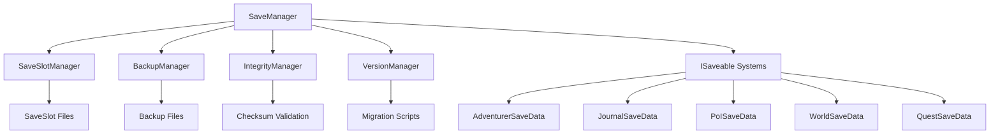

# Save and Load System Design Document

## Overview

The save and load system will provide comprehensive offline-only persistence for the Hidden Horizons auto-explorer game. The system is designed around a modular, extensible architecture that can seamlessly integrate with existing game systems (Adventurer, JournalManager, PoIManager, TimeManager, WeatherManager, ZoneManager) and accommodate future systems like the quest system.

The design follows the ISaveable interface pattern, allowing each game system to define its own serialization logic while the SaveManager orchestrates the overall save/load operations. The system uses JSON for human-readable save files with automatic backup, integrity checking, and version migration capabilities.

## Architecture

### Core Components



### System Integration

The save system integrates with existing game systems through:

1. **Event-driven saves**: Automatic saves triggered by significant game events
2. **ISaveable interface**: Each system implements serialization/deserialization
3. **Dependency injection**: SaveManager is injected into Game1 and distributed to systems
4. **Background operations**: Non-blocking save operations using async/await

## Components and Interfaces

### ISaveable Interface

```csharp
public interface ISaveable
{
    string SaveKey { get; }
    object GetSaveData();
    void LoadSaveData(object data);
    int SaveVersion { get; }
}
```

### SaveManager

The central orchestrator responsible for:
- Coordinating save/load operations across all systems
- Managing save slots and metadata
- Handling automatic and manual saves
- Providing save/load progress feedback

**Key Methods:**
- `SaveGameAsync(int slotId)`: Asynchronous save operation
- `LoadGameAsync(int slotId)`: Asynchronous load operation
- `RegisterSaveable(ISaveable saveable)`: Register systems for saving
- `GetSaveSlotInfo()`: Retrieve save slot metadata

### SaveSlotManager

Manages multiple save slots with metadata:
- Save slot creation and deletion
- Metadata tracking (timestamp, playtime, progress)
- Save slot validation and cleanup

**Save Slot Structure:**
```
Saves/
├── slot_1/
│   ├── save.json
│   ├── metadata.json
│   └── backups/
├── slot_2/
│   ├── save.json
│   ├── metadata.json
│   └── backups/
└── slot_3/
    ├── save.json
    ├── metadata.json
    └── backups/
```

### BackupManager

Handles automatic backup creation and management:
- Creates timestamped backups before each save
- Maintains configurable number of backup copies
- Automatic cleanup of old backups
- Backup restoration on corruption detection

### IntegrityManager

Ensures save file integrity:
- SHA-256 checksum generation and validation
- Atomic write operations to prevent corruption
- Corruption detection and automatic recovery
- File locking to prevent concurrent access

### VersionManager

Handles save format versioning and migration:
- Version detection and compatibility checking
- Automatic migration of old save formats
- Backward compatibility maintenance
- Migration rollback on failure

## Data Models

### GameSaveData

The root save data structure containing all game state:

```csharp
public class GameSaveData
{
    public int Version { get; set; } = 1;
    public DateTime SaveTimestamp { get; set; }
    public string GameVersion { get; set; }
    public Dictionary<string, object> SystemData { get; set; }
    public string Checksum { get; set; }
}
```

### AdventurerSaveData

Comprehensive adventurer state persistence:

```csharp
public class AdventurerSaveData
{
    public Vector2 Position { get; set; }
    public Vector2 Velocity { get; set; }
    public Vector2 Direction { get; set; }
    public float Speed { get; set; }
    public float DirectionChangeTimer { get; set; }
    public float DirectionChangeInterval { get; set; }
    
    // Interaction state
    public bool IsInteracting { get; set; }
    public float InteractionTimer { get; set; }
    public float InteractionDuration { get; set; }
    public Guid? CurrentInteractionPoIId { get; set; }
    public Guid? LastInteractionPoIId { get; set; }
    public float InteractionCooldownTimer { get; set; }
    
    // Animation state
    public AnimationType CurrentAnimation { get; set; }
    public int CurrentFrame { get; set; }
    public float AnimationTimer { get; set; }
    public bool IsMoving { get; set; }
}
```

### JournalSaveData

Complete journal system state:

```csharp
public class JournalSaveData
{
    public List<JournalEntry> Entries { get; set; }
    public HashSet<string> VisitedZones { get; set; }
    public HashSet<string> DiscoveredBiomes { get; set; }
    public int TotalZonesVisited { get; set; }
    public int TotalDaysExplored { get; set; }
    public JournalStatistics Statistics { get; set; }
}
```

### PoISaveData

Points of Interest state management:

```csharp
public class PoISaveData
{
    public List<PointOfInterestSaveData> AllPoIs { get; set; }
    public Dictionary<Point, List<Guid>> ChunkPoIMapping { get; set; }
}

public class PointOfInterestSaveData
{
    public Guid Id { get; set; }
    public PoIType Type { get; set; }
    public Vector2 Position { get; set; }
    public string Name { get; set; }
    public string Description { get; set; }
    public bool IsDiscovered { get; set; }
    public bool IsInteractable { get; set; }
    public string ZoneId { get; set; }
    public DateTime? LastInteractionTime { get; set; }
}
```

### WorldSaveData

World state including zones, weather, and time:

```csharp
public class WorldSaveData
{
    public TimeManagerSaveData TimeData { get; set; }
    public WeatherManagerSaveData WeatherData { get; set; }
    public ZoneManagerSaveData ZoneData { get; set; }
}

public class TimeManagerSaveData
{
    public float CurrentTime { get; set; }
    public TimeOfDay CurrentTimeOfDay { get; set; }
    public float DayProgress { get; set; }
    public int CurrentDay { get; set; }
    public float DayDuration { get; set; }
    public float NightDuration { get; set; }
}

public class WeatherManagerSaveData
{
    public WeatherType CurrentWeather { get; set; }
    public float WeatherIntensity { get; set; }
    public float WeatherChangeTimer { get; set; }
    public float NextWeatherChange { get; set; }
    public int RandomSeed { get; set; }
}

public class ZoneManagerSaveData
{
    public string CurrentZoneId { get; set; }
    public Dictionary<string, ZoneSaveData> Zones { get; set; }
    public int RandomSeed { get; set; }
}

public class ZoneSaveData
{
    public string Id { get; set; }
    public string Name { get; set; }
    public string Description { get; set; }
    public BiomeType BiomeType { get; set; }
    public int Width { get; set; }
    public int Height { get; set; }
    public int WorldX { get; set; }
    public int WorldY { get; set; }
    public Dictionary<Direction, string> Connections { get; set; }
    public Dictionary<Direction, bool> GeneratedConnections { get; set; }
    public bool[][] ExploredTiles { get; set; }
    // Note: Terrain and Objects are procedurally generated, not saved
}
```

### SaveSlotMetadata

Metadata for save slot management:

```csharp
public class SaveSlotMetadata
{
    public int SlotId { get; set; }
    public DateTime LastSaveTime { get; set; }
    public TimeSpan PlayTime { get; set; }
    public int CurrentDay { get; set; }
    public string CurrentZoneName { get; set; }
    public BiomeType CurrentBiome { get; set; }
    public int ZonesVisited { get; set; }
    public int JournalEntries { get; set; }
    public string GameVersion { get; set; }
    public long FileSizeBytes { get; set; }
}
```

## Error Handling

### Save Operation Error Handling

1. **Disk Space Check**: Verify sufficient space before saving
2. **Permission Check**: Ensure write permissions to save directory
3. **Atomic Writes**: Use temporary files and atomic moves
4. **Retry Logic**: Exponential backoff for transient failures
5. **Backup Creation**: Always backup before overwriting
6. **Rollback**: Restore from backup on save failure

### Load Operation Error Handling

1. **File Existence**: Check save file exists before loading
2. **Integrity Validation**: Verify checksums before deserialization
3. **Version Compatibility**: Check version and migrate if needed
4. **Backup Recovery**: Attempt backup restoration on corruption
5. **Graceful Degradation**: Continue with partial data if possible
6. **Default Values**: Provide sensible defaults for missing data

### Error Recovery Strategies

```csharp
public enum SaveErrorType
{
    DiskSpaceInsufficient,
    PermissionDenied,
    FileCorrupted,
    VersionIncompatible,
    SerializationFailed,
    NetworkUnavailable, // Future: cloud saves
    UnknownError
}

public class SaveErrorEventArgs : EventArgs
{
    public SaveErrorType ErrorType { get; set; }
    public string ErrorMessage { get; set; }
    public Exception Exception { get; set; }
    public bool CanRetry { get; set; }
    public bool HasBackup { get; set; }
}
```

## Testing Strategy

### Unit Tests

1. **Serialization Tests**: Verify all ISaveable implementations
2. **Integrity Tests**: Checksum generation and validation
3. **Version Migration Tests**: Test migration between versions
4. **Error Handling Tests**: Simulate various failure scenarios
5. **Performance Tests**: Measure save/load times with large datasets

### Integration Tests

1. **Full Save/Load Cycle**: Complete game state persistence
2. **System Integration**: Verify all systems save/load correctly
3. **Backup Recovery**: Test automatic backup restoration
4. **Concurrent Access**: Test file locking and concurrent operations
5. **Cross-Session Compatibility**: Verify saves work across game restarts

### Performance Benchmarks

1. **Save Time**: Target < 500ms for full save
2. **Load Time**: Target < 1000ms for full load
3. **File Size**: Monitor save file growth over time
4. **Memory Usage**: Ensure minimal memory overhead
5. **Background Operations**: Verify no frame drops during saves

## Implementation Phases

### Phase 1: Core Infrastructure
- Implement ISaveable interface and SaveManager
- Create basic JSON serialization/deserialization
- Implement SaveSlotManager with metadata
- Add basic error handling and logging

### Phase 2: System Integration
- Integrate with existing game systems
- Implement AdventurerSaveData, JournalSaveData, etc.
- Add automatic save triggers
- Create save/load UI components

### Phase 3: Advanced Features
- Implement BackupManager and IntegrityManager
- Add version migration system
- Implement background save operations
- Add comprehensive error recovery

### Phase 4: Polish and Optimization
- Performance optimization and profiling
- Comprehensive testing and bug fixes
- User experience improvements
- Documentation and code cleanup

## Future Extensibility

### Quest System Integration

The save system is designed to easily accommodate the upcoming quest system:

```csharp
public class QuestSaveData
{
    public List<QuestInstanceSaveData> ActiveQuests { get; set; }
    public List<Guid> CompletedQuestIds { get; set; }
    public Dictionary<string, object> QuestVariables { get; set; }
    public List<QuestChainProgressSaveData> ChainProgress { get; set; }
}
```

### Additional Future Systems

The ISaveable interface pattern allows easy integration of:
- Inventory system
- Character progression/skills
- Achievements system
- Settings and preferences
- Statistics tracking
- Mod support data

### Cloud Save Support

The architecture supports future cloud save integration:
- Abstract storage providers (local, cloud)
- Conflict resolution for multi-device saves
- Offline/online synchronization
- Save data encryption for cloud storage

## Security Considerations

### Data Integrity
- SHA-256 checksums for corruption detection
- Atomic file operations to prevent partial writes
- File locking to prevent concurrent access
- Backup verification before cleanup

### Privacy Protection
- No personally identifiable information in saves
- Local-only storage (no network transmission)
- Optional save file encryption for sensitive data
- Secure deletion of temporary files

### Anti-Tampering
- Checksum validation to detect modifications
- Version validation to prevent incompatible saves
- Graceful handling of corrupted or modified saves
- Optional save file signing for integrity verification